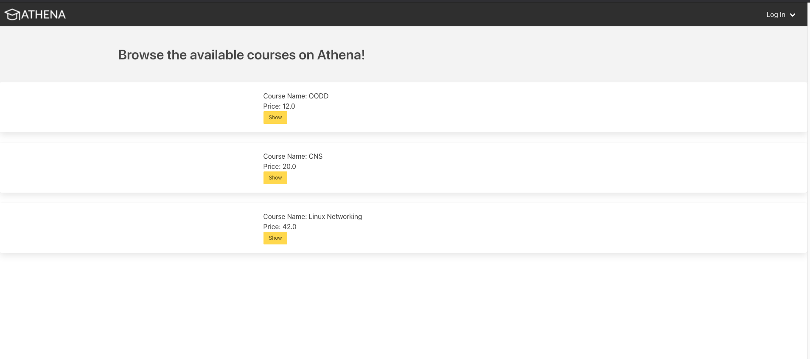
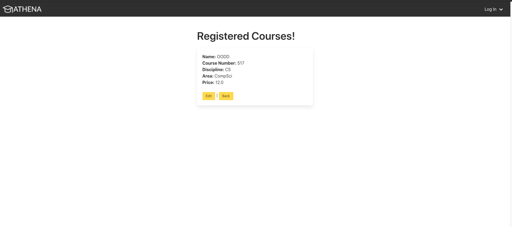
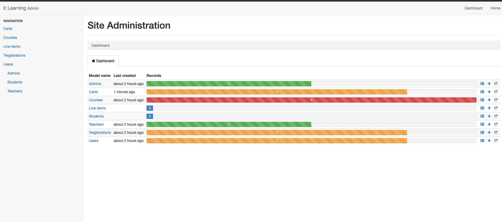
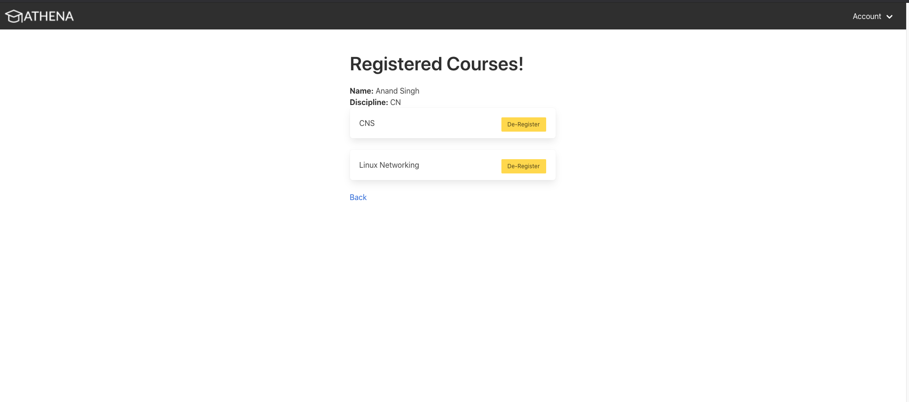

# ATHENA
> Application: https://csc-ece-517-project-2-rds.herokuapp.com/ 

Login Details:
---

Student ID:    dhanraj.vedanth@gmail.com  
Student Pass:  ncsustudent

Teacher ID:    viniotis@ncsu.edu, helen@ncsu.edu, asingh@ncsu.edu  
Teacher Pass:  ncsuteacher

Admin ID:      admin@ncsu.edu  

Admin Pass: ncsuadmin

Run Time Details:
-----------------------------------------------------------------
When you launch the site it will have the login link in the top 
right corner. Use the credentials provided above to login and test
the functionality of the course catalog.

**Admin**  
The admin has a panel that allows all functions. The user is able
to create all other accounts and modify/destroy all populated
objects other than the admin account itself. In the admin panel
you will see navigation to all other generated fields. For
clarification the Sregistrations and Tregistrations are student
registrations and teacher registrations respectively. By deleting
these lines you will effectively be dropping the users from the
courses they signed up for.

**Teacher**  
The teacher has the ability to register for courses related to
their discipline and unregister if needed. They can view the
history of students that have ever signed up for courses that
they are registered to teach. They are also able to view
feedback from any students that have signed up for their classes.
Teachers are able to update information and delete their own 
account from the profile page if they choose to do so.

**Student**  
The student has the ability to add classes to a cart that match
their major and have a teacher registered to teach it. They can
then view their cart and purchase the classes to register for the
courses. They are able to drop courses from their registrations 
if they want to. They can view their course history to see all 
classes they have purchased on their account. They can leave
feedback for any classes that they have signed up for.

